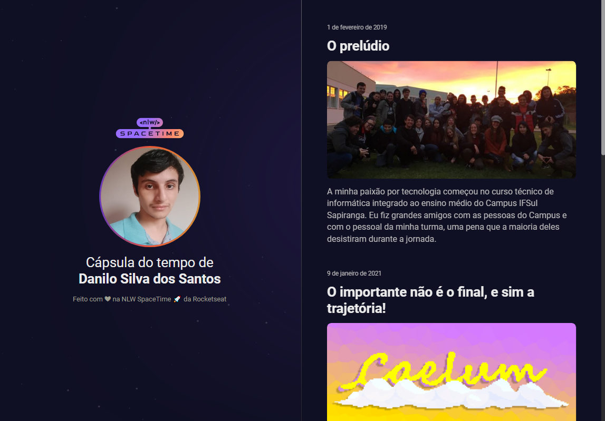

  

## 🖥️ Projeto

Esse é um projeto Web responsivo de uma cápsula do tempo, que possui a finalidade de exibir memórias em uma linha do tempo.

## 🚀 Tecnologias

Esse projeto foi desenvolvido durante o NLW da Rocketseat com as seguintes tecnologias:

- HTML;
- CSS;
- Git e GitHub;
